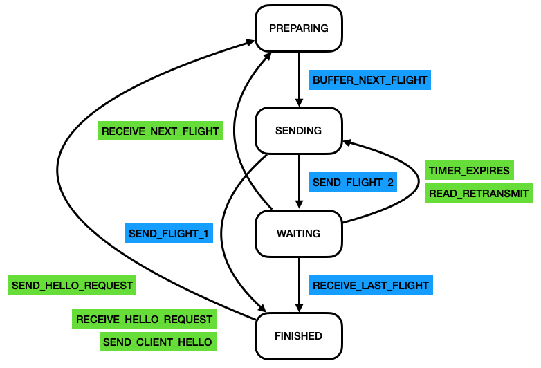

= Kaxis
Xiang Chen <galudisu@gmail.com>
2024-01-24

:keywords: SFL, Pekko, V2X, IOT, CoAP, 5G
:description: A solution to IoT for CoAP.
:url-repo: https://github.com/barudisshu/kaxis.git

[quote,by Xiang Chen]
Distributed to sharding your connected vehicle over DTLS/CoAP...

== FSM

.mbedTLS DTLS server state machine
[plantuml,DTLS,svg]
----
include::mbedTLS_DTLS_server_state_machine_(Reformatted).puml[]
----

the key point of rewrite this protocol is:

- distributed state machine to negotiate the handshake message.
- once the handshake is finished, sharding by `CID` of each message on the server side, so that we don't need to re-handshake or resumption again.

the features of these implementations are:

- low-carbon(低碳) cost. no more heartbeat detection nor frequent cipher-suite/certificate exchange.
- geo-red. connection will be routed to another node while the current worker node is crash without re-handshake.

== Running

.Seed nodes' initialization.
[source,bash]
----
./gradlew -p sharding run --args=4684
./gradlew -p sharding run --args=4685
----

.Work nodes' joining.
[source,bash]
----
./gradlew -p sharding run --args=4686
./gradlew -p sharding run --args=4687
./gradlew -p sharding run --args=4688
----

== Testing UDP

[source,bash]
----
nc -u 0.0.0.0 5684
----

== Testing DTLS

[source,bash]
----
openssl s_client -dtls -CAfile interoperability-tests/rootTrustStore.pem -cert interoperability-tests/client.pem -key interoperability-tests/clientPrivateKey.pem -connect 127.0.0.1:5684 -debug
----

== DTLS Call Flow implementation

Call on the **FLIGHT**.

.Handshake

**Resumption** that once session already exists.

.Resumption

The Finite State Machine of handshake.

.FSM

'''
- I have lost my job now...
- One day I will be back to finish the rest part of the DTLS impl...
- If you are intrested in AIOT, have a glance on link:Designing_Connected_Products.pdf[Designing Connected Products.pdf]

